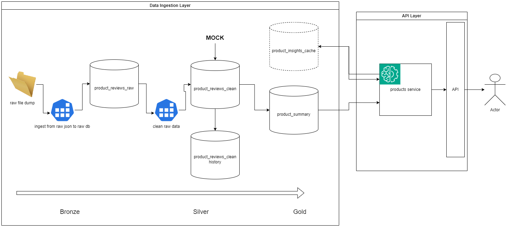
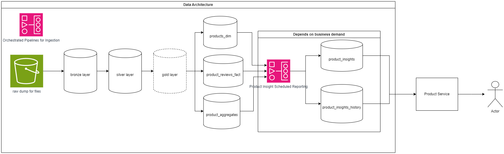

# Amazon Product Performance Solution

## Introduction

This repository contains my initial solution to the problem presented in *TASK_DESCRIPTION.md*. A lot of decisions were made with the constraint of limited business context and time, hence were chosen as a minimum viable product (MVP) for the prototype. However, a correct, long-term solution was kept in mind. Hence, two architecture diagrams will be provided, one for the prototype, and the other for a guessed production-level, long-term solution

The current and proposed solutions are still subject for further refinement.

## Setup Instructions

This setup used docker for the postgres database which stores the data.

To setup the postgres database, make sure that you have docker for your local machine.

### Set up postgres

#### 1. pull image

run `docker pull postgres` in your terminal

#### 2. run the image initalized with a postgres password

run `docker run --name postgres-container -e POSTGRES_PASSWORD=postgres -d -p 5432:5432 postgres`

## Architecture Overview

### Prototype Architecture

#### 1. Data Ingestion Layer

The Data Ingestion layer resembles slightly the medallion architecture (or similar others in concept) of having different layers for the raw, cleaned, and business-ready data.

The raw file dump is any folder available where the json files can be found. In a production system, ideally this would be in a long-term object storage service like Amazon S3. 

The product_summary table is a materialized view of the product_reviews_clean table. 

#### 1.1 History table

Aside from being a core requirement, having a complete history of how the data has changed or evolved allows future consumers of data to recreate insights and reports as if they were made today.

I implemented a version of "slowly changing dimension" (SCD) with the use of a history table, where any change (insert, update) would be recorded as a new record in the history table while the base tables is overwritten as is.

#### 1.2 Mock clean data

In some cases, we can do away with a separate "silver" layer if the bronze layer would suffice. However, in this specific case, the silver layer is composed of mock data where the raw json files are augmented with randomized timestamps.

Rationale: Since the proof of concept for this solution involves providing historical insight, I mocked the possible creation and update timestamps for the product reviews. In a production setting, these should be extracted from the source.

#### 2. API Layer

The API layer integrates with OpenAI's ChatGPT, using the gpt-4o-mini model for speed and cheapness. 

#### 2.1 Product insights

Originally, I considered integrating LLMs for insight gathering, and data augmentation with sentiment analysis. However, this involves non-trivial effort and provides upfront cost.

Solution: The data for the product insights endpoint is retrieved on demand. 

Fast follow optimization: We can implement caching with the database where multiple requests for insights on the same product can reuse the old generated insight to reduce cost.

### Production Architecture

#### 1. Comprehensive Data Architecture

Depending on the state of the data of the business, we can pull from (if existing) or integrate with a consolidated data layer where data from multiple sectors is used. 

If it's going to be used as a service for an API, then we can maintain the use of an OLTP database like postgres as these perform better for that use case.

#### 2. LLM integration for data processing

This is a raw idea that I think is worth mentioning here, but it is not my official proposal. Depending on the further refinement of requirements, we may want to consider integrating the LLM in data ingestion layer. This would allow further augmentation of product review data at a more granular level. 

OpenAI supports this partially with its Batch API where it is 50% cheaper and does bulk processing.

## Key decisions and trade-offs

In this section, I'll try to list decision I think stood out across the solution, as well as decisions which could go in a different direction depending on further refinement.

### 1. postgres for database layer

Postgres is chosen for comfort in the prototype. In a situation where we have a consolidated data architecture for the company, we can opt to use object-storage of parquet files to decouple storage and compute. This is more applicable if we use data platforms such as Snowflake or Databricks.

### 2. addition of silver layer

Had the raw files had timestamps, I think a raw dump file and a bronze table would suffice.

Addition of a silver layer increases storage cost, so we must consider if this is absolutely necessary

### 3. Slowly changing dimension - history table

The slowly changing dimension was made to satisfy the requrirement of **no data loss**. This is best applied for data we are confident would not change as often, such as customer data. The trade-off introduced by something like a history table is the additional storage and cost. It's best to determine with business and other technical teams if a history table would be fine or too much for the business use cases.

The history table is a specific implementation of an SCD, and was chosen because of familiarity. Other implementations can be used depending on appropriateness for the "product review" entity

### 4. On-demand product insight

This was particularly chosen due to limited time constraint as well as the simplest implementation (from my perspective) for a proof of concept.

Whether it is better than a solution where the insights are integrated in the data processing pipeline will depend on refinement of the business requirements. 

## Future improvements

### 1. Database Layer refinement

We can add or change the SCD for other tables.

### 2. Schema refinement for the product insights

The schema provided in the prototype is based on first impression of what can be used by the business. Ideally, this schema is refined continuously and closely with the stakeholders

### 3. Data Pipeline Orchestration

The ingestion pipeline is written all in one repository and coupled together. In a production setting, ideally the steps would be separated to improve monitoring and recovery from failures.

### 4. Unit testing and CI/CD

Unit testing for modules with business logic is important. In a CI/CD setup, the unit testing should be triggered in feature branches as the product gets developed. Here's a sample generic CI/CD flow.

(Upon push in feature)

1. unit test
2. security scan

(Upon merge to branch)

3. build docker image
4. push image to registry
5. deploy to staging
6. deploy to production

We can still refine this depending on resources available.